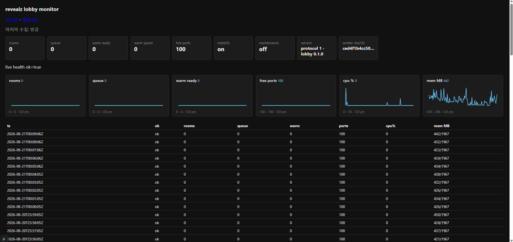
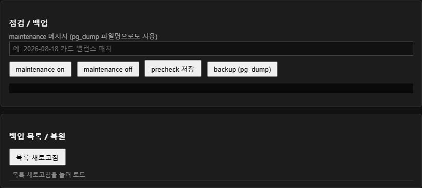
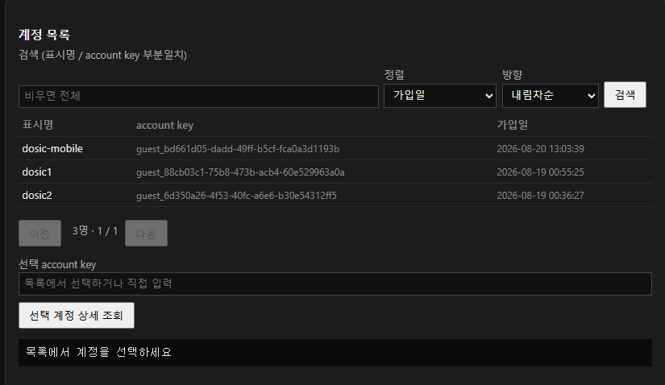
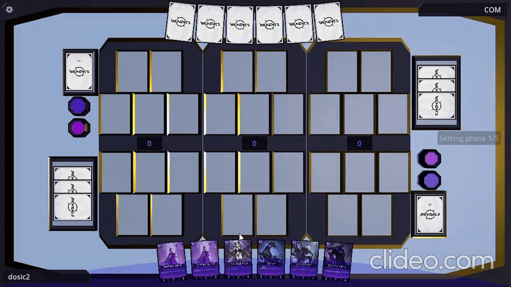
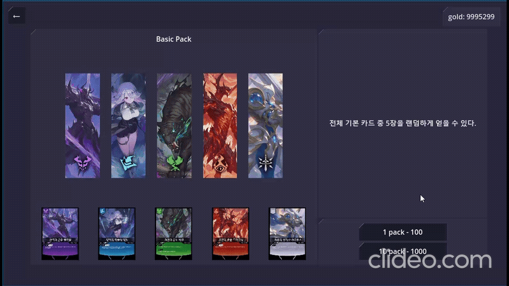

# revealz

Godot 4 턴제 카드 게임 + 온라인 로비·메타·운영 스택.  
**포트폴리오용 Public 레포** — 게임 클라이언트·로비 서버·인프라 코드 포함.

| 항목 | 내용 |
|------|------|
| 기간 | 2025~ (개발 중) |
| 인원 | 1인 개발 |
| 공개 범위 | 소스·에셋(본인 제작/편집) · 시크릿·Dedicated 바이너리·실서버 주소 미포함 |

---

## 프로젝트 소개

- 카드 간 효과와 라인별 파워를 활용해 **2개 이상의 라인에서 승리**하는 턴제 카드 게임
- 턴제 카드 수집 · 팩 오픈 · 덱 편성 · 온라인 대전
- **HTTP 로비**(매칭·메타) + **UDP Dedicated**(실제 대전) 분리 구조
- 계정 · 골드 · 보유 카드는 Postgres 메타 DB로 동기화
- 점검 · 백업 · 유저 조치 · 패치노트는 토큰 보호 관리 화면에서 처리

---

## 담당 역할 · 기여

| 영역 | 담당 | 주요 기여 |
|------|------|-----------|
| 게임 클라 (Godot) | 설계·구현 | 턴/카드/덱/팩/매치 UI·이펙트·서버 권위 세션 |
| 멀티플레이 연동 | 설계·구현 | 로비 HTTP → ENet(UDP) 접속, 방 코드·랜덤 매칭 |
| 로비·메타 서버 | 설계·구현 | Node.js 매칭·spawn·revision·구매·덱 검증 |
| 인프라·운영 | 설계·구현 | Docker Compose, health poller, `/ops`·`/ops/db`, Actions |

---

## 기술 스택

| 영역 | 스택 |
|------|------|
| Client | Godot 4.5, GDScript |
| Lobby / Meta | Node.js (내장 `http`), JavaScript, PostgreSQL 16 |
| Ops | Python (health poller, ops CLI), HTML ops UI |
| Infra | Docker Compose, GitHub Actions |
| Network | HTTP (로비) + UDP / ENet (Dedicated) |

---

## 로컬 실행

### 게임 클라이언트

1. [Godot 4.x](https://godotengine.org/) 설치
2. 이 레포 clone 후 `project.godot` 열기
3. F5 실행 (싱글·UI·덱 에디터 등 로컬 동작 확인)

온라인 매칭은 로비 + Dedicated 바이너리가 필요합니다. 바이너리는 이 레포에 **포함하지 않습니다**.

### 로비 서버 (선택)

```bash
cd lobby
cp .env.example .env
npm ci
npm start
```

- 기본: `http://127.0.0.1:8080`
- `GET /v1/health` 로 상태 확인
- Meta DB 사용 시 Postgres + `META_DATABASE_URL` 설정 (Compose 참고)

### Docker Compose (로비 + DB + poller)

```bash
cp lobby/.env.example lobby/.env
docker compose up -d
```

자세한 내용: [`lobby/README.md`](lobby/README.md)

---

## 코드 리뷰 가이드

| 보고 싶은 것 | 경로 |
|--------------|------|
| ENet 접속·호스트 | [`scripts/network_manager.gd`](scripts/network_manager.gd) |
| 온라인 준비·매칭 UI | [`scenes/screen/online_prepare_screen.gd`](scenes/screen/online_prepare_screen.gd) |
| 메타 동기화·점검 게이트 | [`scripts/meta/meta_sync.gd`](scripts/meta/meta_sync.gd) |
| 서버 권위 매치 | [`scripts/server_authority_session.gd`](scripts/server_authority_session.gd) |
| 로비·매칭·warm·spawn | [`lobby/server.js`](lobby/server.js) |
| 메타 revision·충돌 | [`lobby/meta/routes.js`](lobby/meta/routes.js) |
| ops·모니터 | [`lobby/ops_http.js`](lobby/ops_http.js) |
| health poller | [`tools/ops_health_poll.py`](tools/ops_health_poll.py) |
| CI / VM pull | [`.github/workflows/`](.github/workflows/) |

---

## 아키텍처 (요약)

```text
클라 (Godot) ──HTTP──▶ 로비 (Node) ──spawn──▶ Dedicated (UDP/ENet)
                         │
                         └── Postgres (메타)
poller ──주기──▶ /v1/health ──▶ health.jsonl ──▶ /ops 모니터
```

- 매칭: 큐·warm 풀·listening 로그 확인 후 host/port 전달
- 배포: Actions CI(검사) + VM `git pull` (이미지 재시작은 수동 경계)

---

## 운영 (데모)

### 모니터링



### 점검 · 계정 · 지급 · 패치노트




점검 on/off, 계정 관리, 카드 지급, 패치노트, DB 백업/복구 — [`lobby/ops_db.html`](lobby/ops_db.html) + `tools/ops.py`

---

## 플레이 · 기능 데모

| | |
|---|---|
| 플레이 |  |
| 팩 오픈 |  |
| 온라인 매치 |  |

---

## 저작권 · 공개 범위

- 게임 코드·로비·인프라 설정: **본인 작성**
- 카드 일러스트: **AI 생성(NovelAI) 후 자체 편집**하여 사용
- 전 직장·타사 소스코드·무단 에셋 **미포함**
- 실서버 IP, 운영 토큰, Dedicated 서버 바이너리 **미포함**

---

## 상태

개발 중인 상태로, 언제든지 변경될 수 있습니다.
