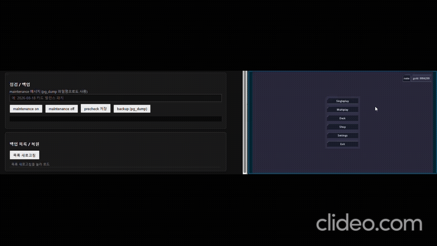
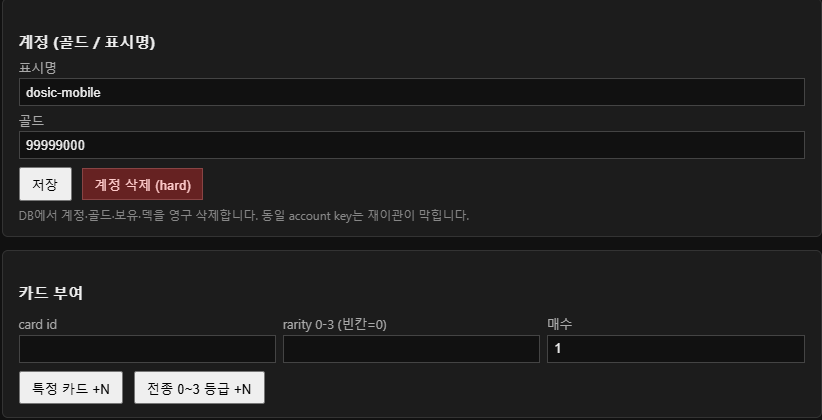
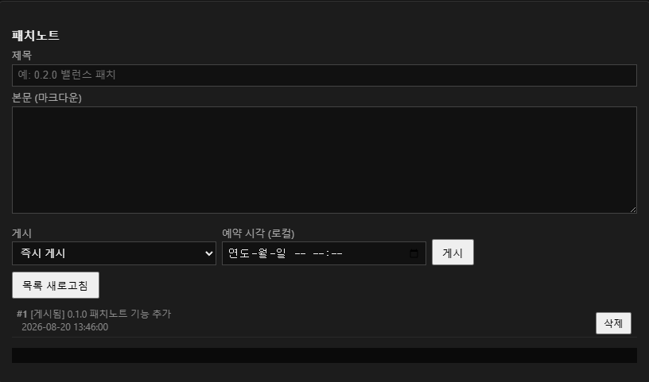

# revealz

Godot 4 카드 게임 + 소규모 VM **운영 스택** 소개 레포.

- 공개 범위: README · 미디어만 (소스 코드 미포함)
- 소개 비중: **빌드·배포 · 모니터링 · 점검 툴 · 형상 관리** 중심
- 플레이·기능 클립은 서비스가 실제로 어떻게 돌아가는지 보여 주는 보조 자료

---

## 프로젝트 소개

- 턴제 카드 수집 · 팩 오픈 · 덱 편성 · 온라인 대전
- 매치마다 전용 게임 프로세스를 띄우는 온라인 구조
- 계정 · 골드 · 보유 카드는 Postgres 메타 DB로 동기화
- 점검 · 백업 · 유저 조치 · 패치노트는 토큰 보호 관리 화면에서 처리

이 레포는 게임 자체보다, 위 서비스를 **어떻게 올리고 · 지켜보고 · 점검하고 · 배포하는지**를 정리한 포트폴리오용 소개입니다.

---

## 운영에서 다룬 일

공고에서 말하는 운영 업무에 맞춰, 이 프로젝트에서 실제로 손댄 축.

| 업무 축 | 이 프로젝트에서 |
|---------|-----------------|
| 빌드 / 배포 자동화 | GitHub Actions로 로비 검사·스모크, `main` 푸시 시 VM git pull. 이미지 재빌드·재시작은 안전 경계로 수동 |
| 모니터링 구축·운영 | health poller → 시계열 기록, `/ops`에서 방·큐·warm·포트·호스트 CPU/메모리 확인 |
| 게임 점검 툴 | `/ops/db` 점검 on/off, 클라 게이트 연동, 계정·지급·패치노트·DB 백업/복구 |
| 형상 관리 | git 기반 배포 경로, Actions SSH pull, 롤백 시 checkout 유지 규칙 |

언어·환경: **Python**(poller · ops CLI) · **JavaScript / Node.js**(로비 · ops UI) · **C++ 계열 런타임**(Godot 전용 서버 바이너리 연동) · Docker Compose · GitHub Actions.

---

## 운영 (메인)

### 1. 구성

| 구성 요소 | 역할 |
|-----------|------|
| Postgres 16 | 계정 · 골드 · 보유 카드 · 덱 · 패치노트 |
| Node 로비 | HTTP 로비 · 매칭 · 메타 API · ops UI |
| health poller | 주기 health 기록 → 모니터 그래프 |
| 전용 게임 바이너리 | 매치당 1프로세스 (VM에 별도 배치) |

- Docker Compose로 Postgres + 로비 + poller 묶음
- 로비·poller는 호스트 네트워크 (UDP 포트 풀)
- Postgres는 127.0.0.1만 열어 외부 직접 접속 차단

### 2. 모니터링


- `/ops` 모니터 개요 — 방 · 큐 · warm · 포트 · 리소스 추이
- 접속 토큰 필요 (없거나 틀리면 404)
- poller가 health를 주기 기록, 호스트 PID 기준으로 CPU·메모리 수집

### 3. 게임 점검 툴


- 점검 on/off + 메시지 설정 패널



- 점검 켜진 뒤 클라에서 온라인/상점 진입이 막히는 흐름

### 4. 유저 · 지급 · 패치노트


- 계정 목록 · 검색 · 정렬 · 골드/표시명 · hard delete



- 카드 단건 / 전종×레어도 지급 (클라 덮어쓰기 방지용 revision 연동)



- 패치노트 작성 · 즉시/예약 발행 · 클라 공개 API

### 5. DB 백업 · 복구

- 관리 화면에서 `pg_dump` 백업 생성 · 목록에서 선택 복원
- 덤프 클라이언트 버전을 DB(Postgres 16)에 맞춤
- 동일 작업은 Python CLI로도 실행

### 6. 클라 ↔ 서버 운영 연동

- 부팅 · 메인 복귀 · 온라인/상점 진입 시 서버 상태 재확인
- 점검 중이면 해당 진입 차단
- 관리자 지급이 클라 저장에 덮이지 않도록 revision 충돌 처리
- 삭제 계정은 재이관 거부

### 7. 빌드 · 배포 · 형상 관리

| 단계 | 하는 일 | 하지 않는 일 |
|------|---------|--------------|
| 로비 CI | 문법 검사 · health 스모크 | 게임 빌드 · 워커 실행 |
| VM pull | `main` 푸시 → 서버 git pull | 이미지 재빌드 · 프로세스 재시작 |

- 재빌드·재시작은 **수동** — 운영 중 실 자동 재시작 사고 완화
- 배포 단위: Compose 서비스 / 로비 이미지 / 전용 서버 바이너리(별도 교체)

---

## 멀티플레이 · 매치메이킹

### 구조

```text
클라 ──HTTP──▶ 로비(Node) ──spawn / UDP 포트──▶ 전용 게임 프로세스
                  │
                  └── Postgres (메타: 계정 · 덱 · 구매)
```

- 로비: 매칭 · 방 배정 · 메타 API (HTTP)
- 대전 패킷: 전용 게임 프로세스와 **UDP** 직접 통신
- 매치마다 새 컨테이너를 만들지 않음 → 로비가 바이너리를 프로세스로 실행

### 입장 방식

1. **방 코드** — 생성 후 코드로 참가 (워커 listen 확인 뒤 접속 정보 발급)
2. **랜덤 매칭** — 큐 등록(티켓) → 폴링 → 2인 매칭 / 취소 / 대기 만료

### 랜덤 매칭 흐름

1. A, B가 매칭 큐에 등록
2. 2명 모이면 로비가 룸(포트) 확보
3. **미리 켜 둔 워커(warm)** 우선, 없으면 신규 실행
4. listening 확인 후에만 양쪽에 접속 정보 전달
5. 이후 클라는 게임 프로세스 UDP로 플레이

### 운영 포인트

- warm 풀로 매칭 지연 감소
- 빈 방 TTL · 매칭 대기 제한 · UDP 포트 범위는 설정으로 조정
- 매치 진입 시 메타 DB로 덱 검증 (실패 시 거절)

---

## 플레이 · 기능 데모

### 플레이


- 매치 · 턴 · 리빌 등 핵심 루프

### 팩 오픈


- 팩 연출 · 카드 획득

### 온라인 매치


- 매칭 후 대전 진입

---

## 기술 요약

- **클라**: Godot 4
- **로비 · ops UI**: Node.js / JavaScript
- **운영 스크립트**: Python (health poller · ops CLI)
- **메타 DB**: PostgreSQL 16
- **인프라**: Docker Compose · GitHub Actions
- **전용 서버**: Godot export 바이너리 (로비가 spawn)

---

## 상태

개발 중인 상태로, 언제든지 변경될 수 있습니다.
