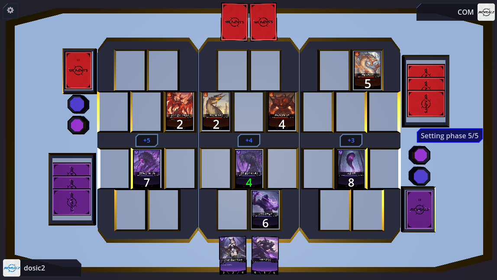
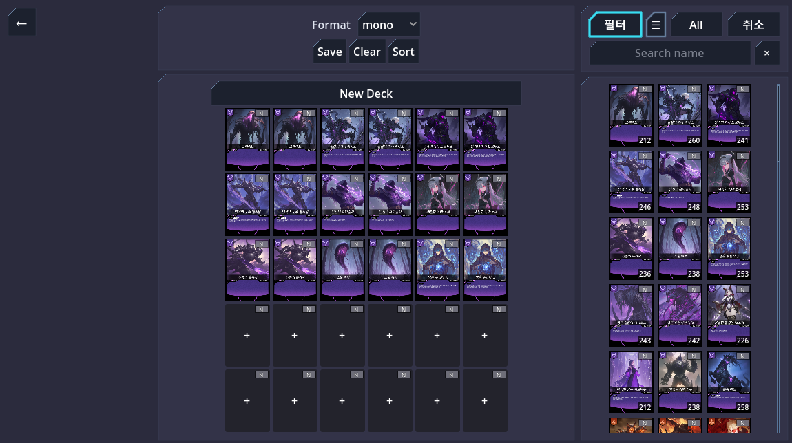
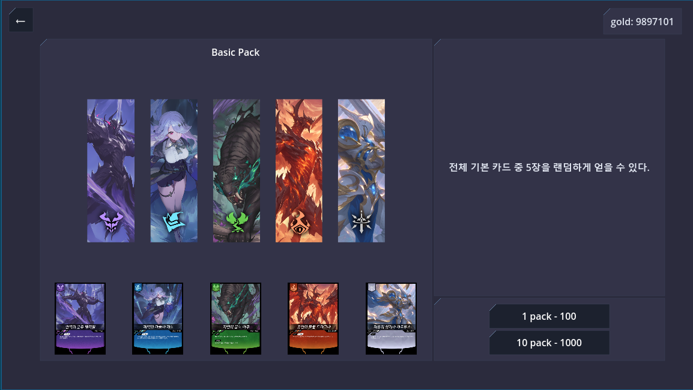
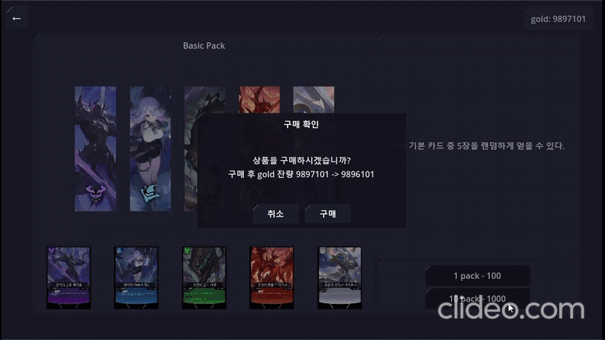
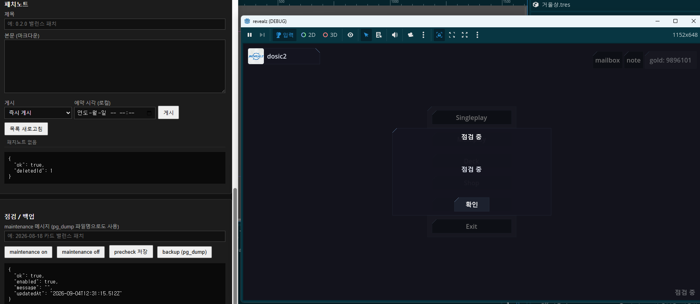

# revealz-online

Godot 4 턴제 카드 게임과, 실제로 게임을 운영하기 위한 프로젝트입니다.

| 항목 | 내용 |
|------|------|
| 기간 | 2025 ~ 진행 중 |
| 인원 | 1인 개발 (클라이언트 / 서버 / 인프라 / 운영) |
| 상태 | **MVP** — 수집 → 덱 편성 → 온라인 대전으로 이어지는 핵심 루프가 실제 서버에서 동작 |
| 공개 범위 | 게임, 서버, 인프라 소스 및 자체 제작 에셋 / 시크릿, 서버 주소, Dedicated 바이너리 제외 |

---

## 개요

**게임 — 클라이언트**
- 라인별 파워를 겨루어 **2개 이상의 라인에서 승리**하여 상대 라이프를 소진시키는 것이 목표인 턴제 카드 게임
- 카드 수집, 팩 오픈, 덱 편성, 싱글 플레이, 온라인 대전
- 서버 권위 매치 세션, 매칭 로딩·대전 연출 UI

**서버 운영 **
- Node.js 로비: 매칭 큐, 전용 서버(Dedicated) 프로세스 spawn, warm 풀, 덱 검증
- PostgreSQL 메타 DB: 계정, 골드, 보유 카드, 상점 카탈로그, 선물함
- Docker Compose 기반 스택 구성, GitHub Actions CI, health poller
- 토큰으로 보호되는 운영 화면: 모니터링, 점검, 계정 조치, DB 백업/복구, 패치노트

---

## 플레이 / 기능

### 인게임

3개 라인에 카드를 배치하고 파워를 겨룹니다. 카드마다 3개 라인에서의 파워가 다르고, 카드 효과가 라인 파워와 서로의 배치에 개입하기 때문에, 어느 라인을 버리고 어느 라인을 가져갈지 고르는 것이 핵심입니다.




### 덱 편집

보유 카드 기준으로 덱을 구성합니다. 포맷별 규칙 검증은 클라이언트뿐 아니라 **로비 서버에서도 다시 검사**해서, 조작된 덱으로 매치에 들어오지 못하게 막습니다.



### 상점 · 팩 오픈

가격/확률/카드 풀은 클라이언트가 아니라 **DB의 상점 카탈로그**에 있습니다. 클라이언트는 "어떤 상품을 몇 개 산다"만 보내고, 실제 차감과 랜덤 획득은 서버 트랜잭션 안에서 처리됩니다.





### 온라인 매치


---

## 아키텍처

```text
       ┌──────────────── HTTP (로비 · 메타 · 운영) ────────────────┐
       │                                                          │
클라이언트 (Godot) ──── 매칭 요청 ────▶ 로비 서버 (Node.js) ──spawn──▶ 전용 서버 (Godot headless)
       │                                     │                            ▲
       └───────────── UDP / ENet ────────────┼────────────────────────────┘
                                             │
                                    PostgreSQL (메타 DB)

health poller ──주기적 /v1/health──▶ health.jsonl ──▶ /ops 모니터 화면
```

- **HTTP와 UDP를 분리**했습니다. 로비/계정/상점 같은 메타 요청은 HTTP로, 실제 대전 중의 잦은 상태 교환은 지연에 민감하므로 UDP(ENet)로 처리합니다.
- **매칭**: 큐에 들어온 두 명이 매치되면 로비가 전용 서버 프로세스를 띄웁니다. 이때 프로세스가 살아 있는 것만으로 접속 가능하다고 보지 않고, 서버가 실제로 포트를 열었다는 로그를 확인한 뒤에야 클라이언트에 접속 정보를 내려줍니다. 대기 시간을 줄이기 위해 미리 띄워두는 warm 풀도 함께 사용할 수 있습니다.
- **배포 경계**: GitHub Actions는 CI와 VM에서의 `git pull`까지만 담당하고, 컨테이너 재기동은 수동 단계로 남겨 두었습니다. 대전이 진행 중인 상태에서 자동 재시작이 끼어드는 상황을 피하기 위한 의도적인 선택입니다.

---

## 운영

혼자 만든 게임이라도 서버에 올라가는 순간 "지금 문제는 없는지", "문제가 생기면 무엇을 할 수 있는가"에 답할 수단이 필요합니다. 그래서 관측 → 점검 → 조치 → 복구까지의 도구를 함께 만들었습니다.

### 모니터링

poller가 주기적으로 `/v1/health`를 통해 결과를 JSON Lines로 쌓고, 운영 화면이 이를 시계열로 보여줍니다.


### 점검 (maintenance)

운영 화면에서 점검을 켜면 게임 클라이언트가 즉시 점검 안내로 전환됩니다. 서버 쪽 스위치 하나가 실제 게임 통신을 막는 구조라, 긴급 상황에서 배포 없이 유입을 끊을 수 있습니다.



### 백업 / 복구

점검을 건 상태에서 `pg_dump`로 스냅샷을 남기고, 필요하면 목록에서 골라 복구합니다.


### 계정 조치 / 지급 / 패치노트

계정 조회/삭제, 카드/재화 지급(선물함 경유), 패치노트 게시를 운영 화면에서 처리합니다.


---

## 담당 역할

1인으로 진행하였습니다.

| 영역 | 주요 내용 |
|------|-----------|
| 게임 클라이언트 (Godot) | 턴/카드 효과/덱/팩 오픈/매치 UI 및 연출, 서버 권위 세션 |
| 멀티플레이 연동 | 로비 HTTP 매칭 → ENet(UDP) 접속, 방 코드 및 랜덤 매칭 |
| 로비 / 메타 서버 (Node.js) | 매칭 큐, 전용 서버 spawn/warm 풀, 덱 검증, 구매 트랜잭션, revision 충돌 처리 |
| 데이터 (PostgreSQL) | 스키마 설계, 상점 카탈로그, 선물함, 백업/복구 |
| 인프라 / 운영 | Docker Compose, GitHub Actions, health poller, 운영 화면 |

설계 배경 및 트레이드오프 기록 일부: [`docs/server_authority_decisions.md`](docs/server_authority_decisions.md)

---

## 기술 스택

| 영역 | 스택 |
|------|------|
| Client | Godot 4.5, GDScript |
| Lobby / Meta | Node.js (내장 `http` 모듈), JavaScript, PostgreSQL 16 |
| Ops | Python (health poller, ops CLI), HTML 운영 UI |
| Infra | Docker Compose, GitHub Actions |
| Network | HTTP (로비 / 메타 / 운영) + UDP / ENet (전용 서버) |

---

## 클라이언트 실행

**[📥 Releases에서 다운로드](https://github.com/codingdosic/revealz-public/releases/latest)**

`revealz_app.exe` 하나만 받아서 바로 실행할 수 있습니다.
- 서버 연결이 필요하며, 현재는 실서버 운영 상태에 따라 가능 여부가 달라집니다.

---

## 앞으로

핵심 루프가 도는 MVP 단계이고, 다음 두 방향으로 계속 다듬고 있습니다.

- **내부**: 선물함·프로필 등 메타 기능 확장, 운영 화면에서의 상점 카탈로그 편집(현재는 DB 직접 수정), 매칭·워커 운용 개선
- **외부**: 카드 밸런스와 룰 조정 — 카드 데이터와 상점 카탈로그가 코드가 아닌 데이터에 있어 클라이언트 재배포 없이 조정 가능

내용은 개발 진행에 따라 언제든지 변경될 수 있습니다.
